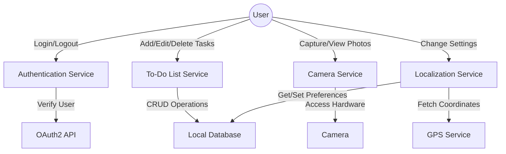

# MultiApp

```Describe the mobile application that you want to implement (Project proposal)
   You have to provide a description of the various functionalities of the application that you want to implement. You
   can use for instance a combination of Use Case Diagram1, a set of Use Cases2, and some Screen Mockups (e.g.,
   create by using Pencil3 or Android Studio).
   Moreover you have to provide a high level technical description of how the application will be implemented. For
   example, which and how software and hardware features will be used: for instance, AsyncTask, Internet, Camera,
   Sensors (e.g., accelerometers, GPS), Remote servers, Database, etc. If you want to implement you application using
   a solution different from Android Studio (e.g., React Native or Flutter) you should briefly describe it and motivate
   the rationale of the choice.
   Output: a pdf file (for instance >2-3 pages long) containing the description of the app.
   Surname_[Surname2]-ProjectProposal.pdf
   ```

    - User authentication via OAuth2
    - Taking pictures using the device camera
    - Creating and managing a To-Do list
    - Saving and retrieving localization settings (e.g., language preference, region-specific settings, etc.)



## Use Cases

User Authentication
    Precondition: User opens the app.
    Main Flow: User logs in using OAuth2.
    Alternative Flow: User decides to skip login (if allowed).
    Postcondition: User gains access to the app functionalities.

To-Do List Management
    Precondition: User is authenticated.
    Main Flow: User can add, edit, delete, and mark tasks as completed.
    Alternative Flow: User views tasks sorted by categories or deadlines.
    Postcondition: Changes are saved to a local database.

Camera Utility
    Precondition: User is authenticated.
    Main Flow: User captures a photo.
    Alternative Flow: User views existing photos.
    Postcondition: Photos are saved to device storage.

Localization Settings
    Precondition: User is authenticated.
    Main Flow: User changes language and regional settings.
    Alternative Flow: User uses GPS to set location-based settings.
    Postcondition: Settings are saved to a local database.

High-Level Technical Description
Technology Stack

    Mobile Framework: Flutter
        Rationale: Flutter allows us to write a cross-platform app with a single codebase, speeding up the development process and making maintenance easier.
    Backend: Firebase Authentication for OAuth2
        Rationale: Provides a quick and secure method for user authentication without requiring a separate backend.

Software and Hardware Features

    Asynchronous Operations: Will use Flutter's Future and async-await for asynchronous tasks like user authentication, database operations, and camera functionalities.

    Internet: Required for OAuth2 authentication through Firebase and API calls for third-party services (if any).

    Camera: Native device camera will be accessed for taking photos.

    Local Database: Will use sqflite for Flutter for storing To-Do List and localization settings locally.

    GPS: Will use Flutter's location package for fetching GPS coordinates for location-based localization settings.

Libraries and Packages

    Firebase Authentication: For OAuth2-based login.
    sqflite: For local database storage.
    camera: To access the camera hardware.
    location: For GPS functionalities.
    flutter_localizations and intl: For localization settings.

By integrating these technologies, we can create a robust and feature-rich application that meets the needs of the modern user.