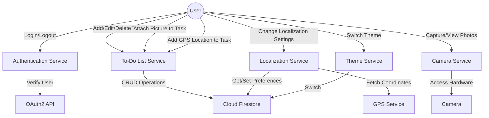

# Project Proposal: Multi-Featured Productivity App

Szymon Zinkowicz 5181814 <5181814@studenti.unige.it> / <szinkowicz@gmail.com>

Overview

The proposed mobile application aims to integrate productivity with real-world utility by combining task management features with location awareness, picture attachments, user authentication, and multiple themes. The app will be implemented in Flutter to facilitate rapid cross-platform development.

- User authentication via OAuth2
- Creating and managing a To-Do list
  - Setting pictures for entires in TODO list
  - Saving and retrieving GPS localization for given entry (E.g. Wash your car - shows where to wash the car on map)
  - settings (e.g. l10n for langauge <English, Polish>, etc.)
- Taking pictures
- Night/Day theme
- Database: Cloud Firestore (Google Cloud)

## Set of Use Cases

### User Authentication

Precondition: User opens the app.
Main Flow: User logs in using OAuth2.
Postcondition: User gains access to the app functionalities.

### To-Do List Management

    Precondition: User is authenticated.
    Main Flow: User can add, edit, delete, and mark tasks as complete.
    Postcondition: Changes are synced to Cloud Firestore.

### Attach Picture to To-Do List Entry

    Precondition: User selects a task.
    Main Flow: User takes or selects a photo.
    Postcondition: Photo is attached to the task and stored in Cloud Firestore.

### Add GPS Location to Task

    Precondition: User selects a task.
    Main Flow: User sets a GPS location for the task.
    Postcondition: Location is saved and associated with the task in Cloud Firestore.

### Localization Settings

    Precondition: User is authenticated.
    Main Flow: User changes language settings.
    Postcondition: Language settings are updated and stored in Cloud Firestore.

### Camera Utility

    Precondition: User is authenticated.
    Main Flow: User captures a photo.
    Postcondition: Photo is saved to device storage.

### Switch Theme

    Precondition: User is authenticated.
    Main Flow: User switches between day and night themes.
    Postcondition: Theme setting is updated and stored in Cloud Firestore.

## High-Level Technical Description

### Technology Stack

**Mobile Framework**: Flutter
    Rationale: Allows for rapid cross-platform development and easy integration with Firebase.

**Database**: Cloud Firestore
    Rationale: Real-time syncing capabilities, good integration with Flutter.

**Authentication**: OAuth2 via Firebase
    Rationale: Secure and standardized, enables social logins.

### Software and Hardware Features

**Asynchronous Operations**: Dart’s Future and async-await will be utilized for all asynchronous tasks.

**Internet**: Required for authentication, database sync, and third-party services.

**Camera**: Native camera API will be used for photo capturing.

**GPS**: Native GPS API will be used for location tagging.

**Theme**: Local device settings or database settings will be used to determine the app theme.

**Localization**: Native Flutter libraries for localization settings.

### Libraries and Packages

- firebase_auth: For OAuth2 authentication.
- cloud_firestore: For database operations.
- camera: For camera utility.
- location: For GPS utility.
- flutter_localizations and intl: For localization.

By incorporating these features and technologies, the application will offer an all-in-one productivity and utility platform. With the chosen stack and architecture, the app is positioned to be robust, scalable, and user-friendly.
